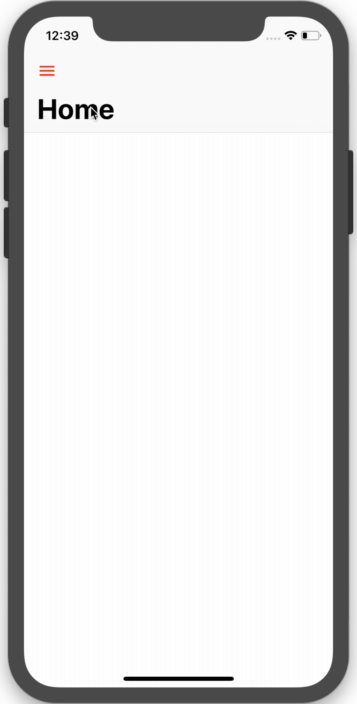

# SlideInTransition

## Purpose
_SLideInTransition_ is an repo for display side menu bar with slide animation and routing to other viewcontroller.

## Authors

### iOS

- Tushar Jaunjalkar

### What you will learn:
- Swift 4.2
- Storyboards
- iOS Transitioning APIs
- Animiations

## Demo

